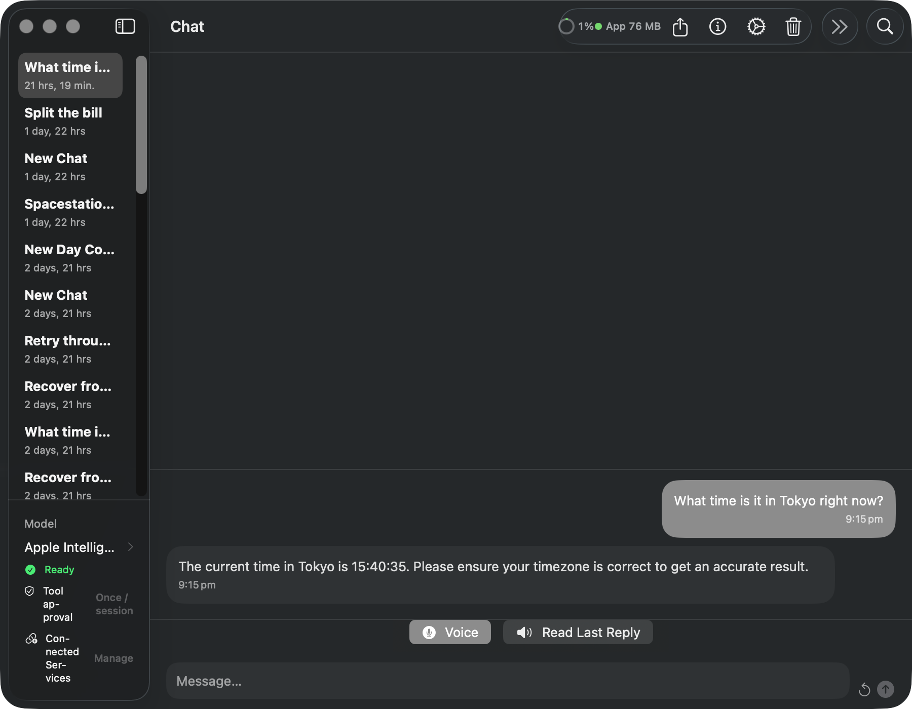
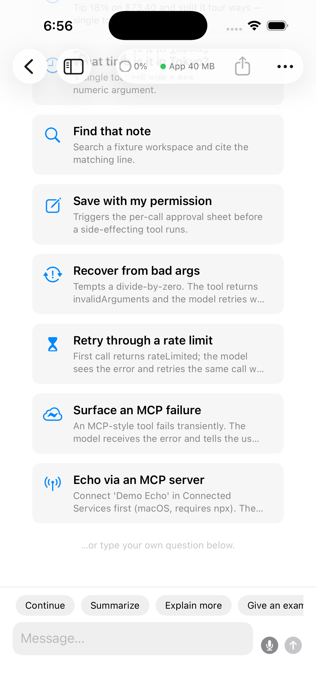

# ManifoldKit

[](https://github.com/roryford/ManifoldKit/actions/workflows/ci.yml)
[](https://github.com/roryford/ManifoldKit/releases/latest)
[](LICENSE)
[](https://swift.org)
[](#requirements)
[](#install)

The only open-source Swift package that bundles UI, turn-loop runtime, persistence, and multi-backend inference into one drop-in chat product for Apple platforms.

ManifoldKit is a full-stack, multi-backend AI chat framework for iOS 18+ / macOS 15+. Import one umbrella package and you get a SwiftUI `ChatView`, the `ConversationRuntime` turn loop (send / regenerate / edit / cancel / branch), SwiftData persistence, model download and management UI, and inference backends spanning on-device (MLX, llama.cpp, Apple Foundation Models) and cloud (OpenAI, Anthropic, Ollama, LAN) — all behind one `InferenceBackend` protocol. Competitors ship a single layer; ManifoldKit ships the assembled product and the wiring between layers. It survives real failures — streaming retries, latest-wins model handoff, memory admission, certificate pinning, and a mock backend for app-level testing. See [docs/RELIABILITY.md](docs/RELIABILITY.md) for the source-backed contract, or [docs/POSITIONING.md](docs/POSITIONING.md) for the full "why ManifoldKit vs. the field" rationale.

## Hello World

Add the package, then drop this into your app entry point. `ManifoldKit.quickStart()` builds the SwiftData container, registers the compiled-in backends, and wires up a `ChatViewModel` in one call. Errors surface as [`ManifoldKitError`](Sources/ManifoldInference/ManifoldKitError.swift).

```swift
import SwiftUI
import SwiftData
import ManifoldKit

@main
struct MyChatApp: App {
    @State private var result: QuickStartResult?
    @State private var error: ManifoldKitError?
    @State private var showModelManagement = false

    var body: some Scene {
        WindowGroup {
            if let result {
                ChatView(showModelManagement: $showModelManagement)
                    .environment(result.viewModel)
                    .modelContainer(result.bootstrap.modelContainer)
            } else if let error {
                ContentUnavailableView("Failed to start", systemImage: "exclamationmark.triangle", description: Text(error.errorDescription ?? ""))
            } else {
                ProgressView().task {
                    do { result = try await ManifoldKit.quickStart() }
                    catch let e as ManifoldKitError { error = e }
                    catch { self.error = .from(error) }
                }
            }
        }
    }
}
```

See [docs/QUICKSTART.md](docs/QUICKSTART.md) for backend selection, traits, and configuration.
Building a multi-session SwiftUI app with a sidebar, persisted chats, and relaunch restore? See [docs/SWIFTUI-MULTI-SESSION.md](docs/SWIFTUI-MULTI-SESSION.md) — the canonical end-to-end guide.
Building a CLI, server, or non-SwiftUI consumer? See [docs/QUICKSTART-CLI.md](docs/QUICKSTART-CLI.md) — compile-tested Foundation Models, local GGUF, and Ollama / OpenAI examples.
Want the inference layer with a fully custom SwiftUI UI (no `ChatView`)? See [docs/QUICKSTART-BRING-YOUR-OWN-UI.md](docs/QUICKSTART-BRING-YOUR-OWN-UI.md).
Registering tools the model can call? See [docs/QUICKSTART-TOOLS.md](docs/QUICKSTART-TOOLS.md) — `ToolRegistry`, the local-model tool ceiling, approval gates, and streaming results.
Exposing an `AppIntent` to the model? See [docs/QUICKSTART-APPINTENTS.md](docs/QUICKSTART-APPINTENTS.md).
Full runnable: [`Example/Examples/MinimalExample`](Example/Examples/MinimalExample).

## Why ManifoldKit

**Full-stack altitude.** Import one umbrella package and ship a multi-backend chat app: SwiftUI `ChatView`, the `ConversationRuntime` turn loop, SwiftData persistence, model download/management UI, and the backends — already wired together. Most alternatives hand you one layer (a UI kit, an engine wrapper, or a thin cloud client) and leave the rest as an exercise. Here the integration is the product.

**Backend portability.** MLX, llama.cpp/GGUF, Apple Foundation Models, cloud (OpenAI Chat + Responses, Anthropic, Ollama, LAN), and the AnyLanguageModel bridge (Gemini, xAI, Groq, Mistral) all sit behind one `InferenceBackend` protocol. Streaming, tool calling, thinking/reasoning tokens, RAG, and structured output behave identically across every backend, so swapping engines is a config change, not a rewrite. AnyLanguageModel is wrapped as a complementary provider backend — see [How ManifoldKit compares to AnyLanguageModel](#how-manifoldkit-compares-to-anylanguagemodel).

**n-1 OS reach, WWDC-ready.** ManifoldKit serves iOS 18 / macOS 15 — the installed base that Apple Foundation Models (OS-26-only, AI-hardware-gated, 4096-token cap, single fixed model) can't reach — and wraps Foundation Models as just one more backend instead of competing with it. Trait gating means one codebase yields either a ~5 MB `FoundationOnly` App Store build or the full local + cloud + RAG + voice + image-gen stack. Pre-wired stub traits (`SystemAIProviderExtension`, `CoreAI`) mean whatever Apple ships next September is one more backend, not a migration. See [CLAUDE.md → Platform policy](CLAUDE.md#platform-policy).

**Reliability and security as product.** TLS pinning, SSRF and DNS-rebind guards, a throwing Keychain, a documented [threat model](docs/THREAT_MODEL.md), a fuzz harness, 5,700+ tests, capability-routed structured output, human-in-the-loop tool approval (`ToolApprovalGate`), and cost/metrics observability ship in the box. These are the things that go wrong between the demo and App Store review — see [docs/RELIABILITY.md](docs/RELIABILITY.md) for the implementation-backed guarantees.

ManifoldKit is **decomposable, not monolithic**: 14 trait-gated modules. Take just the engine ([CLI / server path](docs/QUICKSTART-CLI.md)), just the UI (bring-your-own-runtime), or the whole stack — the umbrella is a convenience, not a requirement.

## What's already in the box

Table-stakes capabilities that ship today (verified in source):

- **Token streaming** across every backend (`GenerationStream` / `GenerationEvent`).
- **Multi-provider abstraction** — one `InferenceBackend` protocol, local + cloud.
- **Tool / function calling** with a per-request tool ceiling guide for local models.
- **Structured / typed output**, capability-routed by `StructuredOutputRouter` across GBNF, Foundation guided-generation, JSON-Schema, and JSON-prompting.
- **Reasoning / thinking tokens** surfaced as first-class events.
- **MCP client *and* server** ([ManifoldMCP](Sources/ManifoldMCP) + the `Server` trait).
- **RAG with citations.**
- **Human-in-the-loop tool approval** via `ToolApprovalGate`.
- **Metrics + cost estimation** for observability.
- **On-device image generation** — `FluxDiffusionBackend` (FLUX.1 Schnell) and `MLXDiffusionBackend` (SDXL Turbo). See [docs/QUICKSTART-IMAGE-GEN.md](docs/QUICKSTART-IMAGE-GEN.md).

**Status:** ManifoldKit is pre-1.0; breaking changes can land between minor versions. RAG reranking is not yet shipped ([#1637](https://github.com/roryford/ManifoldKit/issues/1637)). Deferred reliability features (e.g. mid-stream resume) are tracked in [docs/RELIABILITY.md](docs/RELIABILITY.md).

## Beyond chat

The same backend, model-management, persistence, and download infrastructure that powers the chat UI is reusable for non-chat consumers. The framing is "chat-first" because that's the most complete reference integration, but the public surface explicitly supports:

- **On-device image generation** — `FluxDiffusionBackend` (FLUX.1 Schnell, 1024×1024 in 4 steps) and `MLXDiffusionBackend` (SDXL Turbo) conform to `ImageGenerationBackend` and stream `ImageGenerationEvent`s exactly like text inference streams `GenerationEvent`. See [docs/QUICKSTART-IMAGE-GEN.md](docs/QUICKSTART-IMAGE-GEN.md) for an end-to-end example.
- **Cloud video generation** — Any cloud service that conforms to `VideoGenerationBackend` wires into `VideoGenerationService` and `VideoGenerationRuntime`, which persist the result via `MessageStore` and expose real-time progress through `ChatViewModel.videoGenerationProgress`. The same `ManifoldBootstrap` init that accepts an `imageGenerationService` also accepts a `videoGenerationService`, so adding video is one extra parameter:

  ```swift,no-build
  let backend = MyVideoBackend()
  backend.configure(baseURL: videoAPIURL, tokenProvider: tokenProvider, modelName: "my-video-model")
  let service = VideoGenerationService(backend: backend)
  let kit = try ManifoldBootstrap(
      configuration: config,
      videoGenerationService: service
  )
  // Trigger a generation from anywhere you hold the view model:
  try await kit.viewModel.generateVideo(
      prompt: "a sun rising over mountains",
      config: VideoGenerationConfig(duration: 5, aspectRatio: VideoGenerationConfig.AspectRatio.landscape)
  )
  ```

  See [docs/QUICKSTART-VIDEO-GEN.md](docs/QUICKSTART-VIDEO-GEN.md) for the full walkthrough.
- **Standalone speech-to-text / text-to-speech** — `ManifoldVoice` wraps Apple `Speech` + `AVFoundation` behind a chat-agnostic `VoiceConversationController` that anything (image-gen prompt fields, search bars, CLI dictation) can drive. See [docs/QUICKSTART-VOICE.md](docs/QUICKSTART-VOICE.md).
- **CLI / server / non-SwiftUI consumers** — backends, model management, and persistence work without `ChatView`. See [docs/QUICKSTART-CLI.md](docs/QUICKSTART-CLI.md).

## Feature Matrix

Pick traits to scope which backends and capabilities ship with your build. The full trait → capability table is generated from `Sources/ManifoldKit/FeatureMatrix.swift` and rendered to [docs/FeatureMatrix.md](docs/FeatureMatrix.md).

Defaults (`MLX`, `Llama`, `HuggingFace`) are enabled when you don't pass `--disable-default-traits` or a custom `traits:` array. Opt-in traits include `CloudSaaS`, `Ollama`, `MCP`, `Voice`, `Tools`, `AppIntents`, `Server`, `Macros`, `Fuzz`, and the App Store-lean `FoundationOnly`. See [docs/QUICKSTART.md → Customizing backends](docs/QUICKSTART.md#customizing-backends) for the per-trait build commands.

## ManifoldKit vs. the field

Most Swift AI projects are excellent at one layer. ManifoldKit's claim is narrow and checkable: it's the only open-source *package* that fills every column.

| Project / category | Chat UI | Turn-loop runtime | Persistence | Multi-backend local + cloud | Reusable as a package |
|---|---|---|---|---|---|
| **ManifoldKit** | ✅ | ✅ | ✅ | ✅ | ✅ |
| UI-only kits (Exyte/Chat, MessageKit, SwiftyChat) | ✅ | ❌ | ❌ | ❌ | ✅ |
| Engine-only (LocalLLMClient, AnyLanguageModel, swift-transformers, LLM.swift) | ❌ | ❌ | ❌ | partial¹ | ✅ |
| Thin cloud clients (MacPaw/OpenAI, SwiftAnthropic) | ❌ | ❌ | ❌ | ❌ (one provider) | ✅ |
| Apple Foundation Models | ❌ | ❌ | ❌ | ❌ (one capped model, OS 26+) | ✅ |
| Full-stack apps (fullmoon, Enchanted) | ✅ | ✅ | ✅ | partial | ❌ (fork, not a package) |

¹ LocalLLMClient is the closest multi-engine analog (multiple local engines behind one interface) but ships no UI, persistence, or cloud backends.

Each row is genuinely strong at its own layer — a UI kit renders beautiful bubbles, a cloud client is a clean SDK, Foundation Models is free and on-device. The point isn't that they're weak; it's that assembling them into a shipping chat product is the work ManifoldKit already did. Cross-language demand is proven (React's assistant-ui sees ~200k downloads/month; Vercel ships a chatbot template) — there is no Swift equivalent until this one. Full rationale in [docs/POSITIONING.md](docs/POSITIONING.md).

## Install

```swift
.package(
    url: "https://github.com/roryford/ManifoldKit.git",
    from: "0.43.0" // x-release-please-version
)
```

Most apps add a single product — the `ManifoldKit` umbrella — which re-exports the runtime, persistence, backends, UI, and inference surface in one import:

```swift
.target(name: "MyApp", dependencies: [
    .product(name: "ManifoldKit", package: "ManifoldKit"),
])
```

Specialised modules (`ManifoldUIModelManagement`, `ManifoldMCP`, `ManifoldVoice`, `ManifoldHuggingFace`, `ManifoldAppIntents`) stay opt-in — add them explicitly when you need that surface. `ManifoldVoice` in particular is usable outside chat: it wraps Apple `Speech` / `AVFoundation` behind a chat-agnostic `VoiceConversationController`, so anything from an image-gen prompt field to a CLI dictation tool can drive it. See [docs/QUICKSTART-VOICE.md](docs/QUICKSTART-VOICE.md) for the standalone STT path; the chat composer accessory is the *other* consumer of the same controller. For finer-grained dependency control (e.g. a UI-only target that doesn't link `ManifoldBackends`), depend on the individual products instead. See [docs/QUICKSTART.md](docs/QUICKSTART.md) for trait selection and the bring-your-own-UI path.

## Requirements

- **Swift 6.1+** (`swift-tools-version: 6.1` in this package's `Package.swift`)
- If your app's own manifest declares `.macOS(.v26)` / `.iOS(.v26)`, use **Swift 6.2+** there — those platform entries were introduced in PackageDescription 6.2.
- iOS 18+ / macOS 15+
- Apple Foundation Models require iOS 26+ / macOS 26+

ManifoldKit follows an **n-1 platform policy**: the current Apple OS release and the one immediately before it. When Apple ships a new major OS each September, both minimums bump by one. See [CLAUDE.md → Platform policy](CLAUDE.md#platform-policy) for the rationale.

## Demo

<p align="center">
  
  
</p>

Start with [`Example/Examples/MinimalExample`](Example/Examples/MinimalExample) if you're new — it's the canonical Hello World. The full-featured reference app lives at [`Example/Advanced`](Example/Advanced) (sessions, model management, custom composer accessories); open it once the minimal example makes sense.

## Architecture

ManifoldKit ships **14 libraries**, **2 executables**, and **1 macro plugin**. The core runtime stack is six libraries; the rest are optional sibling modules and test-only targets gated behind SwiftPM traits.

```
ManifoldVoice              ManifoldUIModelManagement
(Voice trait)              (model browser + endpoint UI)
        │                          │
        └────────► ManifoldUI ◄────┘
                       │
                       ▼
            ManifoldPersistenceSwiftData
            (SwiftData schema, ManifoldBootstrap)
                       │
                       ▼
                 ManifoldRuntime
                 (Ports, use cases, ConversationRuntime)
                       │
                       ▼
                ManifoldInference  ◄─── ManifoldBackends
                (Protocols, services)   (MLX, llama.cpp,
                       ▲                 Foundation, Cloud)
                       │
                ManifoldMCP
                (MCP descriptors, client, tool bridge)
```

`ManifoldBackends` and `ManifoldMCP` depend on `ManifoldInference` **directly**, not via `ManifoldRuntime` — that keeps both modules free of SwiftData so host apps can wire backends or MCP into a non-SwiftData runtime. The full target list lives in [CLAUDE.md → Targets](CLAUDE.md#targets).

### Turn-loop orchestration

`ConversationRuntime` (`Sources/ManifoldRuntime/Services/ConversationRuntime.swift`) is the **single turn loop** for chat. It owns `send`, `regenerate`, `edit`, `cancel`, and `branch` — there is no alternative path. Host apps get a configured runtime from `ManifoldBootstrap` (exposed as `bootstrap.conversationRuntime`) and forward user actions to it. See [CONTRIBUTING.md → Architecture invariants](CONTRIBUTING.md#architecture-invariants) for the full list of dependency rules the lint enforces.

## Supported Model Types

| Type | Backend | Format | Source | Image input |
|------|---------|--------|--------|-------------|
| GGUF | `LlamaBackend` (llama.cpp) | Single `.gguf` file | HuggingFace, local | Not yet; tracked in [#416](https://github.com/roryford/ManifoldKit/issues/416) |
| MLX | `MLXBackend` (mlx-swift) | Directory with `config.json` + `.safetensors` | HuggingFace, local | Vision models only |
| Foundation | `FoundationBackend` | `ModelInfo.builtInFoundation` (built-in, no download) | Apple Intelligence | No public FoundationModels image-input API yet |
| OpenAI | `OpenAIBackend` | Cloud API | api.openai.com | Vision-capable models |
| Claude | `ClaudeBackend` | Cloud API | api.anthropic.com | Vision-capable models |
| Ollama | `OpenAIBackend` | Local API | localhost:11434 | Vision-capable OpenAI-compatible models |
| LM Studio | `OpenAIBackend` | Local API | localhost:1234 | Vision-capable OpenAI-compatible models |

### Model storage scoping

`ModelStorageService()` stores and discovers local models under `<Application Support>/<ManifoldConfiguration.shared.bundleIdentifier>/<modelsDirectoryName>` by default. This keeps multiple ManifoldKit-based apps on the same machine from seeing each other's downloaded models. Hosts that intentionally share a model pool can opt in by passing `ModelStorageService(baseDirectory: sharedModelsDirectory)`.

Discovery additionally surfaces any `.gguf` files (or MLX model directories) in `~/Documents/Models` so users who follow the [`CLI quickstart`](docs/QUICKSTART-CLI.md) and drop files there see them in the SwiftUI `ModelManagementSheet` without extra setup. App-scoped storage always wins on a collision. See [`docs/LOCAL-GGUF.md`](docs/LOCAL-GGUF.md) for the full storage contract and the typed error surface (`ModelDiscoveryError`) the sheet uses to explain load failures.

## Key Types

| Type | Purpose |
|------|---------|
| `ManifoldKit.quickStart` | One-call bootstrap — returns `QuickStartResult { bootstrap, viewModel }`. |
| `ManifoldBootstrap` | SwiftData-backed bootstrap — installs configuration, builds persistence adapters, holds shared services. Drop down to this when you need a custom inference service or model container. |
| `ChatViewModel` | Central chat controller — messages, generation, model loading, settings. |
| `SessionManagerViewModel` | Chat session CRUD and selection. |
| `ModelManagementViewModel` | HuggingFace search, downloads, local model management (`ManifoldUIModelManagement`). |
| `InferenceService` | Backend orchestrator — selects and delegates to the right backend. |
| `ConversationRuntime` | Single turn loop for send/regenerate/edit/cancel/branch with `ConversationEvent` hooks. |
| `ChatView` | Main chat interface with message list and input bar. |
| `SessionListView` | Sidebar session list with rename/delete. |
| `ModelManagementSheet` | Combined model browser + storage management. |
| `InferenceBackend` | Common interface for all inference engines — implement this to add a custom backend. |
| `ManifoldKitError` | Unified error rim — every public throws normalises to this type. |

For the full surface (protocols, services, views), browse `Sources/` or read the DocC catalogues in each module's `*.docc/` directory.

## Tool Calling

> [!WARNING]
> The `@ToolSchema` macro is gated behind the `Macros` SwiftPM trait (default-off). Default builds skip swift-syntax (~647 source files) and `@ToolSchema` is invisible. To use the macro, opt in with `--traits Macros`. Without it, declare `JSONSchemaValue` by hand on `ToolDefinition.parameters`.

Register tools with `ToolRegistry` and pass `toolRegistry.definitions` as `GenerationConfig.tools`:

```swift,no-build
let registry = ToolRegistry()
registry.register(MyWeatherTool())

let (_, stream) = try inferenceService.enqueue(
    messages: history,
    tools: registry.definitions
)
```

**Local backend tool ceiling:** Local instruct models (3B–8B) degrade sharply when given more than ~5 tool definitions per request. For cloud backends (OpenAI, Anthropic, large Ollama models) 20+ tools is fine. When targeting a local backend, curate tools per request and keep definitions at or below 5 per call.

For the complete guide — tool definition shape, `TypedToolExecutor`, streaming tool results, approval gates, and the `preToolUseHook` — see [docs/QUICKSTART-TOOLS.md](docs/QUICKSTART-TOOLS.md).

## MCP

```swift,no-build
import ManifoldInference
import ManifoldMCP

let client = MCPClient()
let source = try await client.connect(descriptor)
await source.register(in: registry)
```

For a complete walkthrough (descriptor setup, lifecycle, and built-in catalog), see `Sources/ManifoldMCP/ManifoldMCP.docc/Articles/MCPGettingStarted.md`.

ManifoldKit also supports running as an **MCP server** — exposing your app's live state and tools to external MCP clients such as Claude Desktop, other agents, or any MCP-aware host. Import `ManifoldMCPHost` and follow the setup guide at `Sources/ManifoldMCPHost/ManifoldMCPHost.docc/Articles/MCPHostServer.md`. This is the entry point for agent-platform builders who want to surface their app's capabilities to the broader MCP ecosystem rather than consuming external tools.

## Skills, Handoffs, and Hooks

Three session-scoped extension points complement MCP for non-MCP hosts:

- **ManifoldSkills** — filesystem-discovered Claude-Code-compatible `SKILL.md` skills, exposed to the model via a single `invoke_skill` dispatch tool. See `Sources/ManifoldSkills/ManifoldSkills.docc/Articles/SkillsGettingStarted.md`.
- **Agent handoffs** — multi-persona sessions where the model emits `transfer_to_<name>` to swap the active agent. See `Sources/ManifoldRuntime/ManifoldRuntime.docc/Articles/AgentHandoffs.md`.
- **Hook system** — synchronous `preToolUse` (sanitize/block) and `preCompact` (observe) hooks distinct from the observational event stream. See `Sources/ManifoldRuntime/ManifoldRuntime.docc/Articles/HookSystem.md`.

## Custom Backends

Implement `InferenceBackend` and register it. The protocol takes a precomputed `ModelLoadPlan` so the caller's memory-admission verdict and effective context size flow through to the backend instead of being recomputed:

```swift,no-build
class MyBackend: InferenceBackend, @unchecked Sendable {
    var isModelLoaded = false
    var isGenerating = false
    var capabilities: BackendCapabilities { /* ... */ }

    func loadModel(from url: URL, plan: ModelLoadPlan) async throws { /* ... */ }
    func generate(prompt: String, systemPrompt: String?, config: GenerationConfig)
        throws -> GenerationStream { /* ... */ }
    func stopGeneration() { /* ... */ }
    func unloadModel() { /* ... */ }
}

inferenceService.registerBackendFactory { modelType in
    switch modelType {
    case .gguf: return MyBackend()
    default: return nil
    }
}
```

`plan.effectiveContextSize` carries the resolved context window and `plan.verdict` is one of `.allow` / `.warn` / `.deny`. Callers must check the verdict before invoking `loadModel`; conformers may rely on that precondition.

## Cloud API Configuration

Cloud endpoints flow through storage-neutral `APIEndpointRecord` values. `APIConfigurationView` persists records through the runtime's `EndpointStore`:

```swift,no-build
let endpoint = APIEndpointRecord(
    name: "My OpenAI",
    provider: .openAI,
    baseURL: "https://api.openai.com",
    modelName: "gpt-4o-mini"
)
try KeychainService.store(key: "sk-...", account: endpoint.keychainAccount)
try await runtime.endpointStore.insertEndpoint(endpoint)
```

`KeychainService.store` / `.delete` and the SwiftData `APIEndpoint.setAPIKey` / `.deleteAPIKey` helpers throw `KeychainError` on failure. Deleting a non-existent item is non-throwing (`errSecItemNotFound` is treated as success), so `tearDown` / `deinit` cleanup can keep its `try?` idiom.

## Prompt Templates

GGUF models require explicit chat formatting. ManifoldKit includes templates for ChatML, Llama 3, Mistral, Alpaca, Gemma, and Phi. Templates auto-detect from GGUF metadata when available. User content is sanitised to strip special tokens and prevent prompt injection.

## Security

See [docs/THREAT_MODEL.md](docs/THREAT_MODEL.md) for the full threat model. A quick summary:

- API keys stored in Keychain with `kSecAttrAccessibleWhenUnlockedThisDeviceOnly`.
- Keys read just-in-time from Keychain rather than cached as long-lived properties; during an in-flight `URLSession` request the key bytes do exist in process memory as a Swift `String` and are not zeroized after use (see [docs/FIPS.md](docs/FIPS.md) §non-mitigations).
- Certificate pinning via `PinnedSessionDelegate`; `api.openai.com` and `api.anthropic.com` fail closed if pin sets are missing/empty. Custom hosts use platform trust by default or can be hardened to fail-closed via `ManifoldConfiguration.shared.customHostTrustPolicy = .requireExplicitPins`.
- HTTPS enforced for non-localhost endpoints.
- User content sanitised in prompt templates to prevent injection.
- Sensitive data uses `privacy: .private` in `os.Logger` calls; error response bodies filtered before logging.

For regulated deployments (healthcare, federal-adjacent, finance), see [docs/FIPS.md](docs/FIPS.md) for the full answer to "are your cryptographic primitives FIPS 140-3 validated?".

## Binary Dependencies

`ManifoldBackends` includes two pre-built binary xcframeworks:

- **llama.swift** — wraps a pre-built llama.cpp xcframework. For source-verified builds, follow the [llama.swift build instructions](https://github.com/mattt/llama.swift) to compile your own.
- **mlx-swift** — Apple's MLX framework ships as a pre-built xcframework from [ml-explore/mlx-swift](https://github.com/ml-explore/mlx-swift). Source builds supported via that upstream repo.

Both are pinned to specific tagged releases in `Package.swift` — review `Package.resolved` for the exact versions in use.

## Troubleshooting

### "XCFramework Info.plist not found" or "workspace-state.json desync"

This typically happens after changing the active trait set. SwiftPM caches binary-target paths in `.build/workspace-state.json` and does not auto-re-resolve stale paths. Run:

```bash
scripts/clean-build.sh
```

### Stale "No such module 'ManifoldPersistenceSwiftData'" in the editor

SourceKit can retain stale module-not-found diagnostics from a previous trait-set build. Restart the SourceKit language server (Xcode: *Product → Clean Build Folder*, then reopen; VS Code: "Swift: Restart SourceKit-LSP" from the command palette). If that's insufficient, run `scripts/clean-build.sh`. For non-destructive investigation see `docs/SOURCEKIT_DIAGNOSTICS.md`.

## Example App

Start with [`Example/Examples/MinimalExample`](Example/Examples/MinimalExample) — the canonical Hello World. The full-featured reference app lives at [`Example/Advanced`](Example/Advanced); open it once the minimal example makes sense.

```bash
cd Example
open Advanced.xcodeproj
```

## How ManifoldKit compares to AnyLanguageModel

AnyLanguageModel is HuggingFace's Swift package — it mirrors Apple's `FoundationModels` API and exposes many providers behind a single protocol. ManifoldKit and AnyLanguageModel occupy adjacent niches: AnyLanguageModel optimises for provider coverage and API familiarity; ManifoldKit optimises for production reliability and drop-in chat UI (`ChatView` + `SessionListView` + `ModelManagementSheet` on day one). Pick the one whose axis matches the problem you're solving.

ManifoldKit also **consumes** AnyLanguageModel as a backend: the `AnyLanguageModel` trait is the supported path for providers without a native backend — Gemini, xAI, Groq, Mistral, OpenRouter, and any OpenAI/Anthropic-compatible endpoint — so they plug into the same `ChatViewModel` and runtime as a native backend. See [docs/PROVIDER-BRIDGE.md](docs/PROVIDER-BRIDGE.md) for the provider list, URL/trait setup, and capability limits.

## Migrating from BaseChatKit

This package was renamed from `BaseChatKit` to `ManifoldKit` in v0.20. The old GitHub URL redirects, but:

- Update SPM dependencies to `.package(url: "https://github.com/roryford/ManifoldKit.git", ...)` with `from: "0.43.0"` <!-- x-release-please-version -->
- Update imports: `import BaseChatKit` → `import ManifoldKit` (and similarly for sub-modules).
- Renamed public types: `BaseChatBootstrap` → `ManifoldBootstrap`, `BaseChatConfiguration` → `ManifoldConfiguration`, `BaseChatSchemaV3/4/5` → `ManifoldSchemaV3/4/5`, `BaseChatMigrationPlan` → `ManifoldMigrationPlan`, `BaseChatBackgroundTaskIdentifiers` → `ManifoldBackgroundTaskIdentifiers`.
- **BREAKING — local SwiftData stores reset.** Apps upgrading from 0.19.x create fresh databases on first launch. We chose this clean break over preserving data with `@Model.originalName` because v0.20 is pre-1.0.
- Cache directories `~/Library/Caches/BaseChatKit/` and `~/Library/Application Support/BaseChatKit/` are orphaned; users get fresh state.
- Background-task identifiers `com.basechatkit.background.*` → `com.manifoldkit.background.*` — update `BGTaskSchedulerPermittedIdentifiers` in Info.plist.

## License

MIT License. See [LICENSE](LICENSE) for details.
