# ManifoldKit — Positioning

> Canonical messaging source of truth. The README, launch imagery, and any
> future launch gist derive their language from this document. If a claim here
> conflicts with shipped source, the source wins and this doc gets corrected —
> not the other way around.

---

## 1. One-liner & category

**ManifoldKit is the only open-source Swift package that bundles UI + runtime +
persistence + multi-backend inference into one drop-in chat product.**

**Category:** a full-stack, multi-backend, on-device + cloud AI chat framework
for Apple platforms (iOS 18+ / macOS 15+). **Pre-1.0** — see the
[latest release](https://github.com/roryford/ManifoldKit/releases/latest) for the
current version.

Most "AI for Swift" libraries hand you one layer and leave the integration to
you. ManifoldKit hands you the assembled product — a working chat app you call
one bootstrap to stand up — and keeps every layer swappable underneath.

---

## 2. The problem: a fragmented market with a full-stack hole

The Swift AI ecosystem is real, active, and genuinely good — but it is
fragmented into three non-overlapping slices, none of which is a finished
product:

- **UI-only kits** give you a message list and an input bar. You still have to
  bring an engine, persistence, model management, streaming, retries, and
  cancellation. (Exyte/Chat, MessageKit, SwiftyChat.)
- **Engine-only wrappers** give you tokens out of a model. You still have to
  build the entire app around them — UI, storage, session management, the turn
  loop. (LocalLLMClient, swift-transformers, LLM.swift, AnyLanguageModel.)
- **Thin cloud clients** give you one provider's HTTP surface as typed Swift.
  Switch providers and you start over. (MacPaw/OpenAI, SwiftAnthropic.)

The only things that look "full-stack" are not packages at all — they are
**whole apps you fork** (fullmoon, Enchanted). Forking an app means inheriting
its product decisions, its UI, and its maintenance burden, then surgically
removing everything that isn't your use case.

The demand for the missing middle is proven — just not in Swift yet.
JavaScript has **assistant-ui** (~200k downloads/month) and the **Vercel AI
chatbot template**: batteries-included, drop-in, full-stack chat scaffolding
that developers reach for by reflex. There is no Swift equivalent.

That gap is the entire reason ManifoldKit exists.

---

## 3. Unique value proposition

> **Competitors sell a layer. ManifoldKit sells the assembled product — and the
> wiring between the layers.**

A UI kit is a layer. An engine wrapper is a layer. A cloud client is a layer.
The hard, unglamorous, bug-prone work is never inside a layer — it's at the
**seams**: streaming a backend's tokens into a SwiftUI list without dropping
frames, persisting a half-finished turn so a crash doesn't lose it, swapping
the active model while a load is in flight without corrupting state, making
tool calls behave identically whether the model is on-device or in the cloud.

ManifoldKit's value *is* the seams. You can still drop down to any single layer
— bring your own UI, bring your own backend, bring your own persistence — but
the default path is: add one package, call one function, ship a chat app.

---

## 4. The four pillars

### Pillar 1 — Full-stack altitude

One umbrella `import ManifoldKit` re-exports the runtime, persistence, backends,
UI, and inference surface. `ManifoldKit.quickStart()` builds the SwiftData
container, registers the compiled-in backends, and returns a wired
`ChatViewModel` plus a `ChatView` you can render immediately.

**Proof point:** the canonical Hello World is a single `App` struct — roughly 30
lines — that renders a streaming chat UI with a session sidebar and model
management, with no backend code written by the consumer. The turn loop
(`send` / `regenerate` / `edit` / `cancel` / `branch`) is owned by a single
`ConversationRuntime`; there is no alternative path to keep consistent.

### Pillar 2 — Backend portability behind one protocol

MLX, llama.cpp / GGUF, Apple Foundation Models, and cloud (OpenAI Chat
Completions, OpenAI Responses, Anthropic, Ollama, LAN) all implement the same
`InferenceBackend` protocol. The `AnyLanguageModel` bridge adds Gemini, xAI,
Groq, and Mistral on top. Features — streaming, tool calling, structured
output, cancellation — work *identically* across all of them because they're
implemented above the protocol, not per backend.

**Proof point:** switching a session from a local GGUF model to OpenAI to Apple
Foundation Models changes a backend registration, not the calling code. The
same `enqueue(...)` call, the same `GenerationStream`, the same
`ConversationRuntime` turn loop drives every one.

### Pillar 3 — n-1 OS reach, WWDC-ready

ManifoldKit follows an **n-1 platform policy**: the current Apple OS and the one
before it (iOS 18+ / macOS 15+). Apple Foundation Models is OS-26-only,
AI-hardware-gated, capped at 4096 tokens, and is a single model — it cannot
serve the installed base that ManifoldKit reaches today. ManifoldKit wraps
Foundation Models as *one backend among many*, so an app gets the on-device
Apple model where it's available and a different backend everywhere else,
behind one API.

**Proof point:** the packaging is decomposable. Core ManifoldKit ships with
no MLX/llama binaries at all — a roughly MB-scale, App-Store-lean build is the
default — while adding the `manifold-mlx` / `manifold-llama` companion packages
produces the everything-included stack. Same code, two very different binary
footprints — a `.package(...)` line, not a fork.

### Pillar 4 — Reliability & security as a product feature

The things that go wrong between the demo and App Store review are first-class:
TLS certificate pinning (fail-closed on known cloud APIs), SSRF and DNS-rebind
guards, a throwing Keychain surface, a published `THREAT_MODEL.md`, a fuzz
harness, and **6,500+ tests**. Capability-routed structured output,
human-in-the-loop tool approval, and cost/metrics observability are built in,
not bolted on.

**Proof point:** `RELIABILITY.md` is a source-backed contract, not marketing —
it documents latest-wins model handoff via `LoadRequestToken`, the exact retry
policy (`maxRetries: 3`, exponential backoff with jitter, `Retry-After`
honored), per-backend cancellation semantics, and — pointedly — a "What is not
guaranteed" section that names what ManifoldKit deliberately does *not* do.

---

## 5. ManifoldKit vs. the field

The Swift AI market is layered. ManifoldKit is the only entry that spans all of
it as an installable package.

| Project / category | Layer | UI | Turn loop | Persistence | Multi-backend | Cloud | Form factor |
|---|---|---|---|---|---|---|---|
| **ManifoldKit** | **Full stack** | ✅ | ✅ | ✅ SwiftData | ✅ 4 families + bridge | ✅ | **Package** |
| Exyte/Chat (~1.8k★), MessageKit, SwiftyChat | UI only | ✅ | ❌ | ❌ | ❌ | ❌ | Package |
| LocalLLMClient (~218★) | Engine (multi) | ❌ | ❌ | ❌ | ✅ local only | ❌ | Package |
| AnyLanguageModel | Engine (provider abstraction) | ❌ | ❌ | ❌ | ✅ | ✅ | Package |
| swift-transformers, LLM.swift | Engine (single) | ❌ | ❌ | ❌ | ❌ | ❌ | Package |
| MacPaw/OpenAI, SwiftAnthropic | Cloud client | ❌ | ❌ | ❌ | ❌ one provider | ✅ | Package |
| Apple Foundation Models | System model | ❌ | ❌ | ❌ | ❌ one model | ❌ | OS framework |
| fullmoon, Enchanted | Full app | ✅ | ✅ | ✅ | partial | partial | **App (fork it)** |

**Being fair to the field:** these are good projects solving real problems on
their own axis. **LocalLLMClient** is the closest multi-engine analog and the
nearest neighbor philosophically — but it stops at the engine: no drop-in UI,
no persistence, no cloud. **AnyLanguageModel** has the broadest provider
coverage and the most familiar API for anyone who knows Apple's
`FoundationModels` — ManifoldKit *consumes it* rather than competing with it
(see §9). The **UI kits** are excellent at the thing they do and make no claim
to be more. The **cloud clients** are the right call when you've committed to
one provider and want a clean typed surface.

ManifoldKit's distinct position is the diagonal across this table: not best at
any single layer's niche, but the only thing that assembles all of them into a
product you `import` instead of `git clone`.

**Adjacent end-user apps (not Swift packages).** Developers evaluating
ManifoldKit sometimes compare it against **Ollamac** (macOS Ollama client, Swift
app), **LM Studio** (cross-platform Electron GUI for local model management),
and **AnythingLLM** (Node.js / web RAG assistant). These are *end-user apps*,
not Swift packages or frameworks — they solve "I want to run AI locally" for
end users, while ManifoldKit solves "I want to build and ship an AI feature in
my iOS/macOS app." They serve different jobs. The correct comparison for
ManifoldKit is the table above; the correct comparison for those tools is the
market of chat clients and local-model GUIs.

---

## 6. What's already in the box

There is a persistent narrative that Swift "lags behind" the JS/Python AI
ecosystem on capabilities. For the table stakes that matter to a chat product,
that narrative is out of date. Every item below is verified in ManifoldKit's
source today:

- **Streaming** — token-by-token `GenerationStream` across every backend.
- **Multi-provider abstraction** — one `InferenceBackend` protocol, many engines.
- **Tool calling** — `ToolRegistry` + `ToolDefinition`, local and cloud.
- **Structured / typed output** — capability-routed via `StructuredOutputRouter`:
  GBNF grammars for llama.cpp, Foundation guided-generation, JSON-Schema for
  cloud providers, JSON-prompting as the universal fallback. The framework picks
  the strongest method each backend actually supports.
- **MCP — client *and* server** — `MCPClient` to consume MCP tools, plus a
  server surface to expose them.
- **Reasoning / thinking tokens** — first-class across backends that emit them.
- **RAG with citations** — retrieval, grounding, and `CitationsView`.
- **Tool-approval gating** — human-in-the-loop `ToolApprovalGate` to sanitize or
  block a call before it runs.
- **Metrics + cost estimation** — per-request token and cost observability.
- **On-device image generation** — `FluxDiffusionBackend` (FLUX.1 Schnell) and
  `MLXDiffusionBackend` (SDXL Turbo), streaming `ImageGenerationEvent` the same
  way text streams `GenerationEvent`.

This is the table-stakes checklist met — in one package, behind one import.

---

## 7. Who it's for

### The indie shipping an App Store AI app
**Pain:** you want a polished chat feature now, not a six-week integration
project gluing a UI kit to an engine to a cloud client, then debugging the
seams under App Store review pressure.
**ManifoldKit answer:** `quickStart()` gives you streaming chat, a session
sidebar, and model management on day one. The reliability layer (model handoff,
memory admission, certificate pinning) is the stuff you'd otherwise discover
the hard way from one-star reviews.

### The team that needs local + cloud behind one API
**Pain:** product wants on-device for privacy-sensitive users and cloud for
heavy lifting, and you do not want two code paths that drift apart.
**ManifoldKit answer:** one `InferenceBackend` protocol. Local MLX/GGUF and
cloud OpenAI/Anthropic/Ollama are the same calling convention, the same turn
loop, the same streaming contract. Routing is a backend choice, not a fork.

### The privacy- / offline-first app
**Pain:** your value proposition is "your data never leaves the device," so a
cloud-only or cloud-default SDK is a non-starter.
**ManifoldKit answer:** fully on-device with MLX, llama.cpp/GGUF (via the
companion packages), and Apple Foundation Models — no network required. Link
out the cloud products entirely and ship a build that *cannot* phone home. The
core-only path is a lean, Apple-model-only binary with no heavy ML deps.

### The researcher / tinkerer
**Pain:** you want to swap models, engines, prompt templates, and tools without
rebuilding the whole rig each time, and you want a real test seam.
**ManifoldKit answer:** 28 library products (plus two companion backend
packages) you compose à la carte, a custom
`InferenceBackend` you register in a closure, and a real `MockInferenceBackend`
that exercises the actual streaming and cancellation contract without loading a
model.

---

## 8. The WWDC-2026 / post-WWDC distribution angle

This is the timing hook.

Apple is pushing on-device AI hard, and Foundation Models is the headline. But
Foundation Models, as it stands, is **OS-26-only, AI-hardware-gated, capped at
4096 tokens, and a single model.** The day Apple ships the next thing, every
app that wired directly to one OS framework faces a migration.

ManifoldKit is structured so that **whatever Apple ships next is one more
backend, not a rewrite:**

- **n-1 reach** serves the iOS 18 / macOS 15 installed base that Foundation
  Models can't touch today.
- **Foundation Models is wrapped as one backend** behind the same protocol as
  everything else — apps get the Apple model where it exists and a fallback
  everywhere else, with no branching in product code.
- **A lean core-only build** (no heavy ML dependencies) is the default for
  teams that want the Apple-only App Store binary — just don't add the
  companion packages.
- **The `SystemAIProviderExtension` and `CoreAI` trait stubs are already wired**
  in `Package.swift`, ahead of WWDC. When Apple confirms the real framework and
  entitlement names, activation is a source addition and a `swiftSettings`
  define — no manifest restructuring under keynote-week pressure.

The pitch writes itself: **the App Store is about to fill with apps hard-wired
to one OS-gated model. ManifoldKit treats that model as one option among many,
on the OSes people actually run today, with the next Apple framework already
stubbed for arrival.**

---

## 9. AnyLanguageModel — complementary, not competitive

AnyLanguageModel and ManifoldKit are at **different altitudes**, and conflating
them does both a disservice.

- **AnyLanguageModel is a model-access layer.** It mirrors Apple's
  `FoundationModels` API and exposes many providers behind one familiar
  protocol. Its axis is provider breadth and API familiarity.
- **ManifoldKit is an application framework.** Its axis is the assembled product
  — UI, turn loop, persistence, reliability — and the wiring between layers.

These are adjacent niches, not rivals. ManifoldKit **consumes AnyLanguageModel
as a backend** via a bridge, picking up Gemini, xAI, Groq, and Mistral provider
coverage for free. AnyLanguageModel makes ManifoldKit's backend list longer;
ManifoldKit gives AnyLanguageModel's providers a UI, a database, and a
production reliability layer.

If your problem is "give me clean access to many models," AnyLanguageModel is an
excellent answer. If your problem is "give me a shippable chat app," reach for
ManifoldKit — and notice that AnyLanguageModel is one of the engines under the
hood. (Tracked: [#1638](https://github.com/roryford/ManifoldKit/issues/1638)
graduates the bridge to a documented provider-breadth path.)

---

## 10. Honest current state

Credibility comes from candor. ManifoldKit is **pre-1.0** and is not
pretending otherwise:

- **Breaking changes between minor versions are expected** while the public
  surface settles. The BaseChatKit → ManifoldKit rename in v0.20 reset local
  SwiftData stores deliberately rather than carry migration debt pre-1.0.
- **RAG reranking is pending** — retrieval and citations ship today; the
  reranking stage is tracked in open issue
  [#1637](https://github.com/roryford/ManifoldKit/issues/1637), not yet
  implemented.
- **Mid-stream resume is deferred and documented.** Retries cover connection
  setup, not mid-stream replay; once response bytes arrive, a failure surfaces
  to the stream (preserving partial output) rather than transparently
  replaying. There is no circuit breaker, and idle-timeout stall detection is
  opt-in, not default.
- **Some reliability behaviors require app wiring.** Memory-pressure auto-unload
  fires only if the app forwards events into the view model; arbitrary custom
  HTTPS hosts are not pinned unless the app configures pins.

`RELIABILITY.md` carries a standing "What is not guaranteed" section for exactly
this reason. The promise is not "everything is done" — it's "what we claim is
backed by source, and what isn't done is named."

---

## 11. Key messages — quotable lines

A bank of tight, reusable lines for social, imagery captions, and the launch
gist. Pull from these verbatim.

- **"Competitors sell a layer. ManifoldKit sells the assembled product — and the
  wiring between the layers."**
- **"The value is the seams."** The hard part of an AI app was never inside a
  layer; it's where the layers meet.
- **"JavaScript has assistant-ui and the Vercel template. Swift didn't have an
  equivalent. Now it does."**
- **"One import. One bootstrap. A working chat app."**
- **"Don't fork an app to ship a feature. Add a package."**
- **"MLX, llama.cpp, Apple Foundation Models, and the cloud — behind one
  protocol, with features that work the same on all of them."**
- **"Foundation Models is one model on one OS. ManifoldKit makes it one backend
  among many, on the OSes people actually run."**
- **"Whatever Apple ships next is one more backend, not a rewrite."**
- **"Ship the ~5 MB Apple-only build, or the everything-included stack — same
  package, one trait flip."**
- **"Reliability isn't a feature we'll add later. It's documented, source-backed,
  and shipped — including an honest list of what we don't guarantee."**
- **"The table stakes are met: streaming, tools, structured output, MCP client
  and server, RAG with citations, on-device image gen — in one package."**
- **"We compete on what happens after the demo ends."**
