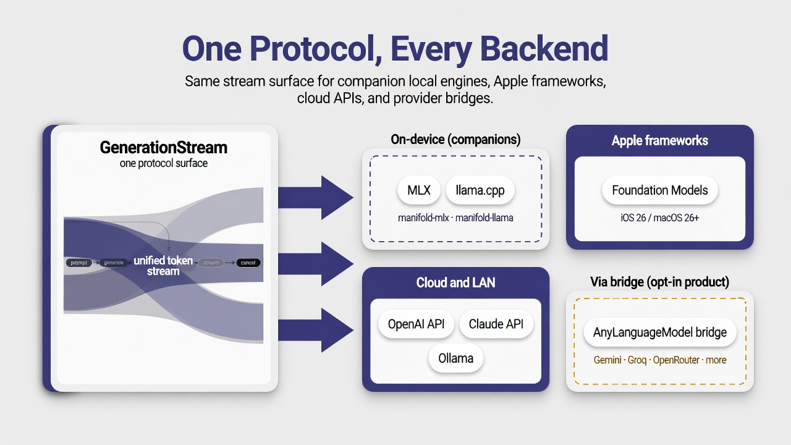
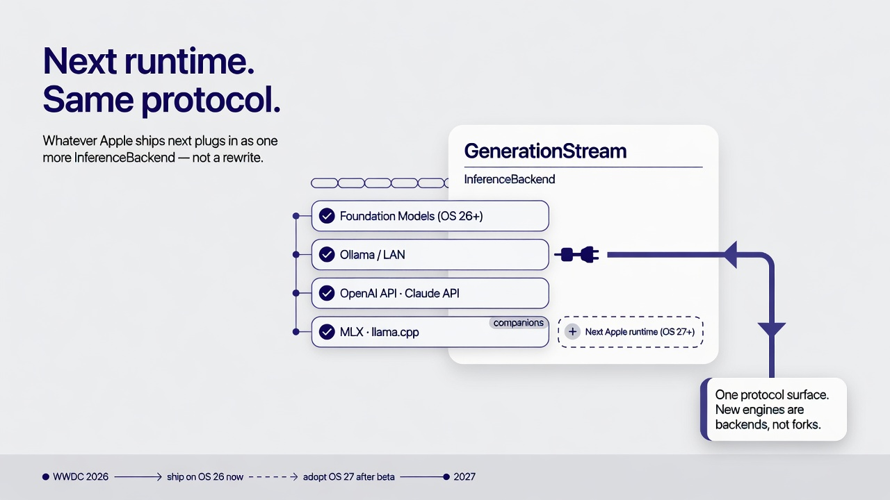
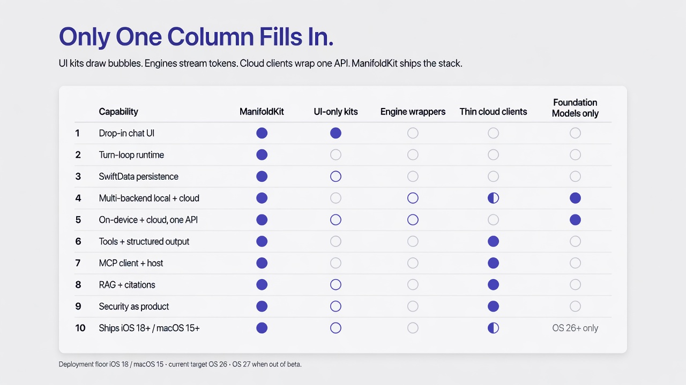

# ManifoldKit — Positioning

**Audience:** consumer
**Status:** living

> Canonical messaging source of truth. The README, launch imagery, and any
> future launch gist derive their language from this document. If a claim here
> conflicts with shipped source, the source wins and this doc gets corrected —
> not the other way around.
>
> Competitive data in this doc was verified against primary sources (GitHub
> APIs, project READMEs, Apple WWDC session transcripts) on **2026-07-07**.
> Star counts and activity dates are point-in-time snapshots and will drift.

---

## 1. One-liner & category

**ManifoldKit is the only open-source Swift package that bundles UI + runtime +
persistence + multi-backend inference into one drop-in chat product.**

**Category:** a full-stack, multi-backend, on-device + cloud AI chat framework
for Apple platforms (iOS 18+ / macOS 15+). **Pre-1.0** — see the
[latest release](https://github.com/ManifoldKit/ManifoldKit/releases/latest) for the
current version.

Most "AI for Swift" libraries hand you one layer and leave the integration to
you. ManifoldKit hands you the assembled product — a working chat app you call
one bootstrap to stand up — and keeps every layer swappable underneath.

---

## 2. The problem: model access is commoditizing; the assembled product is not

The Swift AI ecosystem is real, active, and genuinely good — but it is
fragmented into slices, none of which is a finished product:

- **UI-only kits** give you a message list and an input bar. You still have to
  bring an engine, persistence, model management, streaming, retries, and
  cancellation. (Exyte/Chat, MessageKit, SwiftyChat.)
- **Engine-only wrappers** give you tokens out of a model. You still have to
  build the entire app around them — UI, storage, session management, the turn
  loop. (LocalLLMClient, swift-transformers, LLM.swift, AnyLanguageModel.)
  The closest of these, LocalLLMClient, self-describes as *"still
  experimental. The API is subject to change,"* with tool calling and
  multimodal both labelled experimental.
- **Thin cloud clients** give you one provider's HTTP surface as typed Swift.
  Switch providers and you start over. (MacPaw/OpenAI, SwiftAnthropic.)
- **Ecosystem-bound stacks** solve a vertical, not the platform. SpeziLLM
  (Stanford) is capable — local MLX, OpenAI-compatible remote, fog-node
  inference — but requires the Spezi healthcare DI infrastructure and, as of
  July 2026, has no Foundation Models backend, no MCP, and no RAG.

The only things that look "full-stack" in Swift are not packages at all — they
are **whole apps you fork** (fullmoon, Enchanted; LLMFarm is near-dormant and
currently pulled from TestFlight/App Store). Forking an app means inheriting
its product decisions, its UI, and its maintenance burden.

And since WWDC 2026, the strongest confirmation of the category comes from
Apple itself: the Foundation Models framework now accepts third-party LLM
providers behind a `LanguageModel` protocol (see §8). **Apple has made
multi-model access a platform primitive.** That commoditizes the layer the
engine-wrappers sell — and raises the value of everything above it: the turn
loop, persistence, UI, tool orchestration, and reliability. That "everything
above it" is ManifoldKit.

The demand for the missing middle is proven — just not in Swift yet.
JavaScript has **assistant-ui** (~11k★, the dominant AI-chat-UI library) and
the **Vercel AI SDK + chatbot template**: batteries-included, drop-in chat
scaffolding developers reach for by reflex. React Native has
**react-native-ai** (Callstack, ~1.4k★) shipping Apple Foundation Models +
GGUF + MLC behind the Vercel AI SDK API. There is still no Swift-native
equivalent of the assembled product.

That gap is the entire reason ManifoldKit exists.

---

## 3. Unique value proposition

> **Competitors sell a layer. ManifoldKit sells the assembled product — and the
> wiring between the layers.**

A UI kit is a layer. An engine wrapper is a layer. A cloud client is a layer.
As of WWDC 2026, even *multi-model access* is a layer Apple gives away on the
newest OS. The hard, unglamorous, bug-prone work is never inside a layer —
it's at the **seams**: streaming a backend's tokens into a SwiftUI list
without dropping frames, persisting a half-finished turn so a crash doesn't
lose it, swapping the active model while a load is in flight without
corrupting state, making tool calls behave identically whether the model is
on-device or in the cloud.

ManifoldKit's value *is* the seams. You can still drop down to any single layer
— bring your own UI, bring your own backend, bring your own persistence — but
the default path is: add one package, call one function, ship a chat app.

---

## 4. The four pillars

### Pillar 1 — Full-stack altitude

One umbrella `import ManifoldKit` re-exports the runtime, persistence, backends,
UI, and inference surface. `ManifoldKit.quickStart()` builds the SwiftData
container, registers the compiled-in backends, and returns a wired
`ChatViewModel` plus a `ChatView` you can render immediately.

**Proof point:** the canonical Hello World is a single `App` struct — roughly 30
lines — that renders a streaming chat UI with a session sidebar and model
management, with no backend code written by the consumer. The turn loop
(`send` / `regenerate` / `edit` / `cancel` / `branch`) is owned by a single
`ConversationRuntime`; there is no alternative path to keep consistent.

### Pillar 2 — Backend portability behind one protocol

*This diagram predates [#2435](https://github.com/ManifoldKit/ManifoldKit/issues/2435)
and still shows a "via bridge → AnyLanguageModel bridge" lane — that lane is
retired. See
[MIGRATION-anylanguagemodel-retired.md](MIGRATION-anylanguagemodel-retired.md).*

MLX, llama.cpp / GGUF, Apple Foundation Models, and cloud (OpenAI Chat
Completions, OpenAI Responses, Anthropic, Ollama, LAN, and any
OpenAI-compatible endpoint — xAI, Groq, Mistral, OpenRouter (including Gemini
models via OpenRouter) — via `APIProvider.custom`) all implement the same
`InferenceBackend` protocol.
Features — streaming, tool calling, structured
output, cancellation — work *identically* across all of them because they're
implemented above the protocol, not per backend.

**Proof point:** switching a session from a local GGUF model to OpenAI to Apple
Foundation Models changes a backend registration, not the calling code. The
same `enqueue(...)` call, the same `GenerationStream`, the same
`ConversationRuntime` turn loop drives every one.

### Pillar 3 — n-1 OS reach, platform-shift-ready

ManifoldKit follows an **n-1 platform policy**: the current Apple OS and the one
before it (iOS 18+ / macOS 15+). Everything Apple announced at WWDC 2026 —
the opened Foundation Models framework, the `LanguageModel` provider protocol,
the first-party Claude/Gemini packages, the Spotlight RAG tool — ships with
**the newest OS cycle only**. ManifoldKit delivers multi-backend inference,
tool calling, structured output, and RAG on the installed base those APIs
cannot reach for another one to two OS cycles, and wraps whatever Apple ships
as *one backend among many* behind the same protocol.

**Proof point:** the packaging is decomposable. Core ManifoldKit ships with
no MLX/llama binaries at all — a roughly MB-scale, App-Store-lean build is the
default — while adding the `manifold-mlx` / `manifold-llama` companion packages
produces the everything-included stack. Same code, two very different binary
footprints — a `.package(...)` line, not a fork.

### Pillar 4 — Reliability & security as a product feature

The things that go wrong between the demo and App Store review are first-class:
TLS certificate pinning (fail-closed on known cloud APIs), SSRF and DNS-rebind
guards, a throwing Keychain surface, a published `THREAT_MODEL.md`, a fuzz
harness, and **6,500+ tests**. Capability-routed structured output,
human-in-the-loop tool approval, and cost/metrics observability are built in,
not bolted on.

This pillar is sharpened by the field: the nearest Swift analog labels its
tool calling *experimental*; the strongest cross-platform analog (Cactus)
routes its cloud fallback through a hosted service requiring an API key.
ManifoldKit's equivalents are production-labelled, source-backed, and
self-hosted.

**Proof point:** `RELIABILITY.md` is a source-backed contract, not marketing —
it documents latest-wins model handoff via `LoadRequestToken`, the exact retry
policy (`maxRetries: 3`, exponential backoff with jitter, `Retry-After`
honored), per-backend cancellation semantics, and — pointedly — a "What is not
guaranteed" section that names what ManifoldKit deliberately does *not* do.

---

## 5. ManifoldKit vs. the field

The Swift AI market is layered. ManifoldKit is the only entry that spans all of
it as an installable package. (Stars/activity verified 2026-07-07.)

### Swift-native

| Project / category | Layer | UI | Turn loop | Persistence | Multi-backend | Cloud | Form factor |
|---|---|---|---|---|---|---|---|
| **ManifoldKit** | **Full stack** | ✅ | ✅ | ✅ SwiftData | ✅ 4 families + bridge | ✅ | **Package** |
| Exyte/Chat, MessageKit, SwiftyChat | UI only | ✅ | ❌ | ❌ | ❌ | ❌ | Package |
| LocalLLMClient (~220★, self-declared experimental) | Engine (multi, local) | ❌ | ❌ | ❌ | ✅ local only | ❌ | Package |
| AnyLanguageModel | Engine (provider abstraction) | ❌ | ❌ | ❌ | ✅ | ✅ | Package |
| SpeziLLM (~290★, Spezi-ecosystem-bound) | Engine + fog (vertical) | partial | ❌ | ❌ | ✅ local + OpenAI-compat | ✅ | Package (requires Spezi) |
| swift-transformers, LLM.swift | Engine (single) | ❌ | ❌ | ❌ | ❌ | ❌ | Package |
| MacPaw/OpenAI, SwiftAnthropic | Cloud client | ❌ | ❌ | ❌ | ❌ one provider | ✅ | Package |
| Apple Foundation Models (post-WWDC26) | System model + provider protocol | ❌ | ❌ | ❌ | ✅ via `LanguageModel` (newest OS only) | ✅ via 1st-party packages | OS framework |
| fullmoon, Enchanted | Full app | ✅ | ✅ | ✅ | partial | partial | **App (fork it)** |
| LLMFarm (~2k★, near-dormant, pulled from App Store) | Full app | ✅ | ✅ | ✅ | ❌ GGUF only | ❌ | App (fork it) |

### Cross-platform pressure (not Swift-native, but competing for the same app teams)

| Project | What it is | Overlap / gap vs ManifoldKit |
|---|---|---|
| **Cactus** (~5.4k★, very active) | C++-core "hybrid edge-cloud AI engine for mobile & wearables"; Swift/Kotlin/Flutter/RN/Python/Rust bindings | Overlaps on streaming, tools, embeddings, RAG, vision, vector index; **cloud fallback requires its hosted service + API key**; Swift binding maturity questioned (InfoQ, Dec 2025); not SwiftUI/SwiftData-native |
| **react-native-ai** (Callstack, ~1.4k★) | On-device AI primitives for React Native, drop-in for the Vercel AI SDK; Apple / GGUF / MLC providers | Same multi-backend idea, different ecosystem; its explicit AI-SDK compatibility table and "drop-in" framing are best-in-class DX positioning |
| **assistant-ui** (~11k★) | React chat-UI primitives — "the UX of ChatGPT in your React app"; Radix-style composable Thread/Message/Composer | UI layer only; the composable-primitives model is the pattern ManifoldKit's UI layer should speak to |
| **Vercel AI SDK** | The JS ecosystem's default model-access + streaming layer | The reference point for "batteries-included" DX; no Swift presence |

**Being fair to the field:** these are good projects solving real problems on
their own axis. **LocalLLMClient** is the closest multi-engine Swift analog —
same three local backends, plus Linux — but it stops at the engine (no cloud,
persistence, UI, MCP) and is explicitly experimental. **AnyLanguageModel** has
the broadest provider coverage and the most familiar API for anyone who knows
Apple's `FoundationModels` — an adjacent niche, not a rival (see §9).
**SpeziLLM** is real engineering with one feature ManifoldKit
lacks (fog-node inference over mDNS), but it is a module for a healthcare
ecosystem, not a standalone toolkit. The **UI kits** are excellent at the thing
they do. The **cloud clients** are the right call when you've committed to one
provider. **Cactus** is the one to watch: strong momentum, real feature
overlap, and a genuine wearables/cross-platform story — its trade-offs are a
C++ core, a less-mature Swift binding, and a hosted-service dependency for
hybrid routing.

ManifoldKit's distinct position is the diagonal across the first table: not
best at any single layer's niche, but the only thing that assembles all of
them into a product you `import` instead of `git clone`.

**Adjacent end-user apps (not Swift packages).** Developers evaluating
ManifoldKit sometimes compare it against **Ollamac** (macOS Ollama client),
**LM Studio** (Electron GUI for local models), and **AnythingLLM** (Node.js
RAG assistant). These are *end-user apps* — they solve "I want to run AI
locally" for end users, while ManifoldKit solves "I want to build and ship an
AI feature in my iOS/macOS app."

---

## 6. What's already in the box

There is a persistent narrative that Swift "lags behind" the JS/Python AI
ecosystem on capabilities. For the table stakes that matter to a chat product,
that narrative is out of date. Every item below is verified in ManifoldKit's
source today:

- **Streaming** — token-by-token `GenerationStream` across every backend.
- **Multi-provider abstraction** — one `InferenceBackend` protocol, many engines.
- **Tool calling** — `ToolRegistry` + `ToolDefinition`, local and cloud —
  production-labelled, not experimental.
- **Structured / typed output** — capability-routed via `StructuredOutputRouter`:
  GBNF grammars for llama.cpp, Foundation guided-generation, JSON-Schema for
  cloud providers, JSON-prompting as the universal fallback. The framework picks
  the strongest method each backend actually supports.
- **MCP — client *and* server** — `MCPClient` to consume MCP tools, plus a
  server surface to expose them. No Swift competitor ships either side.
- **Reasoning / thinking tokens** — first-class across backends that emit them.
- **RAG with citations** — retrieval, grounding, and `CitationsView` — on
  iOS 18 / macOS 15, not gated to the newest OS like Apple's Spotlight tool.
- **Tool-approval gating** — human-in-the-loop `ToolApprovalGate` to sanitize or
  block a call before it runs.
- **Metrics + cost estimation** — per-request token and cost observability.
- **On-device image generation** — `FluxDiffusionBackend` (FLUX.1 Schnell) and
  `MLXDiffusionBackend` (SDXL Turbo), streaming `ImageGenerationEvent` the same
  way text streams `GenerationEvent`.

This is the table-stakes checklist met — in one package, behind one import.

---

## 7. Who it's for

### The indie shipping an App Store AI app
**Pain:** you want a polished chat feature now, not a six-week integration
project gluing a UI kit to an engine to a cloud client, then debugging the
seams under App Store review pressure.
**ManifoldKit answer:** `quickStart()` gives you streaming chat, a session
sidebar, and model management on day one. The reliability layer (model handoff,
memory admission, certificate pinning) is the stuff you'd otherwise discover
the hard way from one-star reviews.

### The team that needs local + cloud behind one API
**Pain:** product wants on-device for privacy-sensitive users and cloud for
heavy lifting, and you do not want two code paths that drift apart.
**ManifoldKit answer:** one `InferenceBackend` protocol. Local MLX/GGUF and
cloud OpenAI/Anthropic/Ollama are the same calling convention, the same turn
loop, the same streaming contract. Routing is a backend choice, not a fork —
and it doesn't require anyone's hosted service or API key to route.

### The privacy- / offline-first app
**Pain:** your value proposition is "your data never leaves the device," so a
cloud-only or cloud-default SDK is a non-starter.
**ManifoldKit answer:** fully on-device with MLX, llama.cpp/GGUF (via the
companion packages), and Apple Foundation Models — no network required. Link
out the cloud products entirely and ship a build that *cannot* phone home. The
core-only path is a lean, Apple-model-only binary with no heavy ML deps.

### The researcher / tinkerer
**Pain:** you want to swap models, engines, prompt templates, and tools without
rebuilding the whole rig each time, and you want a real test seam.
**ManifoldKit answer:** 28 library products (plus two companion backend
packages) you compose à la carte, a custom
`InferenceBackend` you register in a closure, and a real `MockInferenceBackend`
that exercises the actual streaming and cancellation contract without loading a
model.

---

## 8. The post-WWDC-2026 landscape: Apple validated the category

At WWDC 2026 Apple made the single biggest change to this market since
Foundation Models shipped (all verified against session transcripts
[339](https://developer.apple.com/videos/play/wwdc2026/339/) and
[241](https://developer.apple.com/videos/play/wwdc2026/241/)):

- **The Foundation Models framework is open to any LLM provider**, local or
  server-based, via two protocols — `LanguageModel` (capabilities + executor
  configuration) and `LanguageModelExecutor` — so every conforming model is
  driven identically through `LanguageModelSession`.
- **Anthropic and Google are shipping first-party Swift packages** exposing
  Claude and Gemini through that session API (Google's via the Firebase SDK).
- **Apple is open-sourcing the framework itself** (later in summer 2026), plus
  `CoreAILanguageModel` and `MLXLanguageModel` implementations and a utilities
  package updated between OS releases.
- **Built-in system tools** arrive inside `LanguageModelSession`, including a
  Spotlight-powered search tool positioned for "fully local RAG."

Read plainly: **Apple just replicated the multi-backend abstraction as a
platform primitive.** That is validation, not defeat — but it changes what
ManifoldKit leads with:

1. **The abstraction layer is no longer the moat.** Projects whose entire
   value is "one API over many models" now compete with the OS itself.
   ManifoldKit's moat was never the abstraction — it's the assembled product
   above it: turn loop, persistence, UI, MCP client+server, tool approval,
   RAG with citations, and the reliability contract. None of that ships in
   `LanguageModelSession`.
2. **Everything Apple announced is newest-OS-only.** ManifoldKit's n-1 policy
   serves the iOS 18 / macOS 15 installed base those APIs will not reach for
   one to two OS cycles. During exactly the window when the App Store fills
   with AI features, ManifoldKit is the way to ship them to everyone.
3. **ManifoldKit rides the shift instead of fighting it.** Apple's new
   provider protocols are one more backend surface: the `CoreAI` and
   `SystemAIProviderExtension` trait stubs have been wired in `Package.swift`
   since before the announcement, and adopting `LanguageModel` /
   `LanguageModelExecutor` — both consuming conforming providers as
   ManifoldKit backends *and* exposing ManifoldKit's backends as providers —
   is an additive integration behind the same `InferenceBackend` protocol,
   not a rewrite.

The pitch: **Apple opened the model layer. ManifoldKit is everything an app
needs above the model layer — on the OSes people actually run today.**

---

## 9. AnyLanguageModel — adjacent, not competitive

AnyLanguageModel and ManifoldKit are at **different altitudes**, and conflating
them does both a disservice.

- **AnyLanguageModel is a model-access layer.** It mirrors Apple's
  `FoundationModels` API and exposes many providers behind one familiar
  protocol. Its axis is provider breadth and API familiarity — a bet that
  looks prescient now that Apple has standardized exactly that shape.
- **ManifoldKit is an application framework.** Its axis is the assembled product
  — UI, turn loop, persistence, reliability — and the wiring between layers.

These are adjacent niches, not rivals — but ManifoldKit does not wrap
AnyLanguageModel as a dependency. It previously did, via a bridge product
(`ManifoldAnyLanguageModel`), retired in
[#2435](https://github.com/ManifoldKit/ManifoldKit/issues/2435) for zero
adoption: the bridge advertised no tool calling, no structured output, and no
thinking-token support. Most of the providers it named (xAI, Groq, Mistral,
OpenRouter — Gemini's own OpenAI-compatible endpoint is not reachable this
way, but its models are available through OpenRouter) are OpenAI-compatible
endpoints reachable through ManifoldKit's own `APIProvider.custom` +
`OpenAIBackend`, with tool calling, structured output, retry, and circuit
breaking the bridge never had. Certificate pinning is not automatic for these
hosts, though: they aren't in the default pin set, and ManifoldKit fails a
credentialed request closed rather than sending it unpinned — populate
`PinnedSessionDelegate.pinnedHosts` or opt out via
`ManifoldConfiguration.allowUnpinnedCredentialedHosts` before the first
request. See
[MIGRATION-anylanguagemodel-retired.md](MIGRATION-anylanguagemodel-retired.md).

If your problem is "give me clean access to many models with a familiar,
`FoundationModels`-shaped API," AnyLanguageModel is an excellent answer. If
your problem is "give me a shippable chat app," reach for ManifoldKit — its
own cloud backends already cover AnyLanguageModel's provider list.

---

## 10. Honest current state

Credibility comes from candor. ManifoldKit is **pre-1.0** and is not
pretending otherwise:

- **Breaking changes between minor versions are expected** while the public
  surface settles. The BaseChatKit → ManifoldKit rename in v0.20 reset local
  SwiftData stores deliberately rather than carry migration debt pre-1.0.
- **RAG reranking is pending** — retrieval and citations ship today; the
  reranking stage is tracked in open issue
  [#1637](https://github.com/ManifoldKit/ManifoldKit/issues/1637), not yet
  implemented.
- **Vision/multimodal input is not shipped** ([#416](https://github.com/ManifoldKit/ManifoldKit/issues/416)
  is blocked upstream). Competitors are not ahead here in practice — the
  nearest Swift analog labels multimodal experimental, and the broadest
  multimodal matrix in Swift (LLMFarm) is near-dormant — but the gap is real
  and named.
- **No hybrid local→cloud auto-routing** — backend choice is explicit today.
  Cactus ships this via its hosted service; a self-hosted equivalent is open
  design space for ManifoldKit, not a shipped feature.
- **Mid-stream resume is deferred and documented.** Retries cover connection
  setup, not mid-stream replay; once response bytes arrive, a failure surfaces
  to the stream (preserving partial output) rather than transparently
  replaying. There is no circuit breaker, and idle-timeout stall detection is
  opt-in, not default.
- **Some reliability behaviors require app wiring.** Memory-pressure auto-unload
  fires only if the app forwards events into the view model; arbitrary custom
  HTTPS hosts are not pinned unless the app configures pins.

`RELIABILITY.md` carries a standing "What is not guaranteed" section for exactly
this reason. The promise is not "everything is done" — it's "what we claim is
backed by source, and what isn't done is named."

---

## 11. Key messages — quotable lines

A bank of tight, reusable lines for social, imagery captions, and the launch
gist. Pull from these verbatim.

- **"Competitors sell a layer. ManifoldKit sells the assembled product — and the
  wiring between the layers."**
- **"Apple opened the model layer. ManifoldKit is everything above the model
  layer — on the OSes people actually run."**
- **"Model access just became a platform primitive. Shipping an AI app didn't."**
- **"The value is the seams."** The hard part of an AI app was never inside a
  layer; it's where the layers meet.
- **"JavaScript has assistant-ui and the Vercel template. Swift didn't have an
  equivalent. Now it does."**
- **"One import. One bootstrap. A working chat app."**
- **"Don't fork an app to ship a feature. Add a package."**
- **"MLX, llama.cpp, Apple Foundation Models, and the cloud — behind one
  protocol, with features that work the same on all of them."**
- **"Everything Apple announced at WWDC ships on the newest OS. ManifoldKit
  ships it on this one and the last one."**
- **"Whatever Apple ships next is one more backend, not a rewrite."**
- **"Hybrid local + cloud without anyone's hosted service in the loop."**
- **"Tool calling that isn't labelled 'experimental'. MCP client and server.
  RAG with citations. Shipped, tested, source-backed."**
- **"Ship the ~5 MB Apple-only build, or the everything-included stack — same
  package, one trait flip."**
- **"Reliability isn't a feature we'll add later. It's documented, source-backed,
  and shipped — including an honest list of what we don't guarantee."**
- **"We compete on what happens after the demo ends."**
